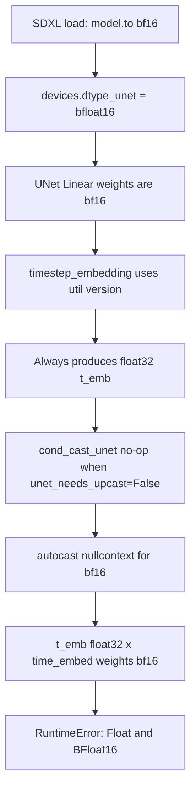

# SDXL + ControlNet + LoRA + bf16 dtype Mismatch Crash — Full Explanation

> **Repository:** `ussoewwin/A1111-for-Python3.12` (workspace `D:\USERFILES\A1111`)  
> **Related release:** [v2.0](https://github.com/ussoewwin/A1111-for-Python3.12/releases/tag/v2.0)  
> **Files changed:** `extensions-builtin/sd-webui-controlnet` only (**`extensions-builtin/Lora/networks.py` intentionally unchanged**)  
> **Example model:** `controlnet-union-pro-max-sdxl-1.0` (ControlNet Union Pro Max SDXL)

---

## Table of contents

1. [Symptoms and full error text](#1-symptoms-and-full-error-text)
2. [How to read the stack trace](#2-how-to-read-the-stack-trace)
3. [Root cause](#3-root-cause)
4. [Why v2.0 bf16 support alone was not enough](#4-why-v20-bf16-support-alone-was-not-enough)
5. [Fix overview](#5-fix-overview)
6. [Full added/changed code](#6-full-addedchanged-code)
7. [Meaning and role of each change](#7-meaning-and-role-of-each-change)
8. [Why `networks.py` was not modified](#8-why-networkspy-was-not-modified)
9. [dtype flow (before and after)](#9-dtype-flow-before-and-after)
10. [Verification steps](#10-verification-steps)
11. [Approaches to avoid](#11-approaches-to-avoid)

---

## 1. Symptoms and full error text

### Reproduction conditions (from reports)

- **Base model:** SDXL family
- **ControlNet:** Union Pro Max SDXL (`controlnet-union-pro-max-sdxl-1.0`)
- **LoRA:** multiple LoRAs loaded at once
- **Hi-Res Fix:** enabled
- **Environment:** CUDA GPU, A1111 v2.0-style logic applying **bfloat16 (bf16)** to SDXL

### Observed behavior

- Crash on the **first step of pass 1** (e.g. 0/16)
- Logs show execution reaching FlashAttention-2 and similar attention paths; failure occurs near **main UNet time embedding**

### Error message

```text
RuntimeError: mat1 and mat2 must have the same dtype, but got Float and BFloat16
```

PyTorch `F.linear` (`torch.nn.functional.linear`) requires the input tensor (`mat1`) and weight tensor (`mat2`) to **share the same dtype**.  
In this case, **input is Float (float32)** and **weights are BFloat16 (bf16)**.

---

## 2. How to read the stack trace

Typical stack (key frames):

```text
extensions-builtin/sd-webui-controlnet/scripts/hook.py
  → forward_webui / forward
  → ~line 800: emb = self.time_embed(t_emb)

extensions-builtin/Lora/networks.py
  → line 946: network_Linear_forward
  → originals.Linear_forward → F.linear

modules/sd_hijack_unet.py
  → apply_model → sgm wrappers → UNet forward patched by ControlNet
```

### Important interpretation

| Aspect | Meaning |
|--------|---------|
| **Where it fails** | Main UNet `time_embed` (Linear for timestep embedding) |
| **ControlNet model (`cldm.py` `forward`)?** | **No.** Stack is inside **hooked main UNet** `forward` in `hook.py` |
| **Caused by LoRA?** | **Not directly.** LoRA hooks `Linear` but **does not cast input dtype by design**, so upstream mismatch surfaces here |
| **bf16-specific?** | Surfaces easily with **bf16 + autocast disabled** (see below) |

---

## 3. Root cause

### 3.1 In one sentence

**Timestep embedding `t_emb` stays float32 into `time_embed` (Linear with bf16 weights), and `F.linear` via LoRA fails on dtype mismatch.**

### 3.2 Causal chain (5 steps)



#### (1) UNet runs in bf16

Forge-compatible logic in `modules/sd_models.py` for SDXL on bf16-capable GPU:

```python
if use_bf16:
    model.to(torch.bfloat16)
    ...
    devices.dtype_unet = torch.bfloat16
```

So UNet `nn.Linear` weights, including `self.time_embed`, are **bf16**.

#### (2) `timestep_embedding` returns float32

ControlNet UNet hook (`hook.py`) imports:

```python
from ldm.modules.diffusionmodules.util import timestep_embedding
```

The **util** implementation computes sin/cos in **float32** and **returns a float32 tensor**.

A1111 core patches only **`openaimodel.timestep_embedding` and `sgm...timestep_embedding`** in `modules/sd_hijack_unet.py`.  
**The util version is not patched.**

#### (3) `cond_cast_unet` does nothing here

`modules/devices.py`:

```python
def cond_cast_unet(input):
    if force_fp16:
        return input.to(torch.float16)
    return input.to(dtype_unet) if unet_needs_upcast else input
```

`unet_needs_upcast` is True mainly with **`--upcast-sampling` and fp16 UNet**.  
For **normal bf16 UNet use it is False**, so `cond_cast_unet(t_emb)` **returns input unchanged (no-op)**.

#### (4) autocast is disabled for bf16

`modules/devices.py` `autocast()`:

```python
if dtype_unet == torch.bfloat16:
    return contextlib.nullcontext()
```

Since v2.0, bf16 inference **does not rely on autocast to align dtypes** (Forge compatibility, avoid dtype clashes).  
Nothing auto-casts before `F.linear`.

#### (5) LoRA `network_Linear_forward` does not cast input

`extensions-builtin/Lora/networks.py`:

```python
def network_Linear_forward(self, input):
    if shared.opts.lora_functional:
        return network_forward(self, input, originals.Linear_forward)
    network_apply_weights(self)
    return originals.Linear_forward(self, input)
```

- **Functional mode** (`network_forward`): uses `cond_cast_unet(input)`
- **Default mode** (path in this stack): **passes input dtype unchanged** to `F.linear`

This is **intentional** (preserve float math and cache consistency for LoRA). **This fix does not change it.**

### 3.3 Why it stands out with ControlNet enabled

ControlNet **replaces the main UNet `forward` entirely** in `hook.py`.  
Inside that replacement, util `timestep_embedding` → `cond_cast_unet` → `time_embed` runs **every step**.

Without ControlNet, the vanilla UNet path may use patched `openaimodel` / `sgm` `timestep_embedding` from `sd_hijack_unet`, where dtypes can align.  
**Only the hook path depends on the util version**, so ControlNet + bf16 was the combination that crashed reliably.

### 3.4 Why fixing ControlNet model side (`cldm.py`) alone was not enough

`cldm.py` `ControlNet.forward` already aligns dtype:

```python
t_emb = timestep_embedding(timesteps, self.model_channels, repeat_only=False).to(self.dtype)
emb = self.time_embed(t_emb)
```

This crash is **not** in the ControlNet submodel `forward`; it is in the **hooked main UNet** `time_embed`.  
Fixing ControlNet dtype alone **leaves main UNet `t_emb` float32**.

---

## 4. Why v2.0 bf16 support alone was not enough

[v2.0](https://github.com/ussoewwin/A1111-for-Python3.12/releases/tag/v2.0) mainly:

- SDXL `model.to(bfloat16)` and `devices.dtype_unet = torch.bfloat16`
- Disabled `autocast()` for bf16
- **Reverted** speculative dtype hacks (e.g. forcing GroupNorm to `float()`) for LoRA compatibility

v2.0 correctly set **main UNet load precision** to bf16, but **ControlNet still treated `use_fp16` as literal float16**, and **hook-path time embedding** still used util float32.

| Layer | Before this fix | This fix |
|-------|-----------------|----------|
| UNet weights | bf16 ✓ | unchanged |
| ControlNet `use_fp16` check | `== torch.float16` only ✗ | extended to `!= float32` ✓ |
| ControlNet `self.dtype` | fixed `torch.float16` ✗ | `devices.dtype_unet` ✓ |
| Hook UNet `t_emb` | stays float32 ✗ | explicit cast to `devices.dtype_unet` ✓ |

---

## 5. Fix overview

| File | Purpose | Effect on this crash |
|------|---------|----------------------|
| `hook.py` | Align hooked UNet `t_emb` with `devices.dtype_unet` | **Direct fix (required)** |
| `controlnet_model_guess.py` | Treat bf16 as `use_fp16=True`; sync `control_model.dtype` after load | ControlNet dtype alignment (complement) |
| `cldm.py` | Set `self.dtype` from `devices.dtype_unet` | ControlNet `forward` alignment (complement) |
| `Lora/networks.py` | **No change** | Preserves LoRA float design |

**Design:** resolve mismatch at the **source (`t_emb`)**; do **not** add unconditional casts in LoRA layers.

---

## 6. Full added/changed code

Below is the **full diff-style change** (3 files).

### 6.1 `extensions-builtin/sd-webui-controlnet/scripts/hook.py`

**Location:** inside `UnetHook`, just before main UNet encoder starts (~old line 799)

```python
            hs = []
            with th.no_grad():
                t_emb = cond_cast_unet(timestep_embedding(timesteps, self.model_channels, repeat_only=False))
                # timestep_embedding (util) always returns float32; cond_cast_unet is a no-op when
                # unet_needs_upcast is false. With bf16/fp16 UNet and no autocast, time_embed Linear
                # weights must match input dtype (LoRA network_Linear_forward does not cast input).
                if t_emb.dtype != devices.dtype_unet:
                    t_emb = t_emb.to(devices.dtype_unet)
                emb = self.time_embed(t_emb)
```

**Added:** 3 comment lines + 2-line `if` block (2 lines of logic)

---

### 6.2 `extensions-builtin/sd-webui-controlnet/scripts/cldm.py`

**Location:** `ControlNet.__init__` `self.dtype` (~old line 123)

**Before:**

```python
        self.dtype = torch.float16 if use_fp16 else torch.float32
```

**After:**

```python
        # use_fp16 means "match UNet reduced precision" (fp16 or bf16), not literal float16 only.
        self.dtype = devices.dtype_unet if use_fp16 else torch.float32
```

**Reference — existing `forward` use of `self.dtype` (unchanged):**

```python
    def forward(self, x, hint, timesteps, context, y=None, control_type: List[int] = None, **kwargs):
        original_type = x.dtype

        x = x.to(self.dtype)
        hint = hint.to(self.dtype)
        timesteps = timesteps.to(self.dtype)
        context = context.to(self.dtype)

        if y is not None:
            y = y.to(self.dtype)

        t_emb = timestep_embedding(timesteps, self.model_channels, repeat_only=False).to(self.dtype)
        emb = self.time_embed(t_emb)
        ...
```

---

### 6.3 `extensions-builtin/sd-webui-controlnet/scripts/controlnet_model_guess.py`

#### (A) New `_sync_control_model_dtype` (near top of file)

```python
def _sync_control_model_dtype(network, config):
    """Keep control_model.dtype aligned with loaded weight dtype (fp16/bf16/fp32)."""
    control_model = getattr(network, 'control_model', None)
    if control_model is not None and hasattr(control_model, 'dtype'):
        control_model.dtype = devices.dtype_unet if config.get('use_fp16', False) else torch.float32
```

#### (B) `use_fp16` check change (3 places)

**Before (all load paths):**

```python
config['use_fp16'] = devices.dtype_unet == torch.float16
```

**After:**

```python
config['use_fp16'] = devices.dtype_unet != torch.float32
```

**Paths:**

1. ControlLoRA branch (`lora_controlnet` in state_dict)
2. SparseCtrl branch
3. Standard ControlNet / **ControlNet Union** branch (`task_embedding` key → Union Pro Max, etc.)

#### (C) `_sync_control_model_dtype` after each load path

**ControlLoRA:**

```python
        network.to(devices.dtype_unet)
        _sync_control_model_dtype(network, config)
        return ControlModel(network, ControlModelType.ControlLoRA)
```

**SparseCtrl:**

```python
        network.to(devices.dtype_unet)
        _sync_control_model_dtype(network, config)
        return ControlModel(network, ControlModelType.SparseCtrl)
```

**Standard / Union ControlNet:**

```python
        network.to(devices.dtype_unet)
        _sync_control_model_dtype(network, config)

        return ControlModel(network, control_model_type)
```

---

## 7. Meaning and role of each change

### 7.1 `hook.py` — dtype repair on hooked main UNet path

| Item | Explanation |
|------|-------------|
| **What it does** | When `t_emb` from `timestep_embedding` differs from `devices.dtype_unet`, cast with `.to(devices.dtype_unet)` |
| **Why needed** | Util embedding is always float32; `cond_cast_unet` and autocast do not fix bf16 normal operation |
| **Why not fix LoRA** | Aligning upstream avoids changing `network_Linear_forward`; preserves LoRA float design |
| **fp16 UNet** | Same alignment when `devices.dtype_unet == float16`; harmless |
| **float32 UNet** | `t_emb` is usually already float32; branch is effectively no-op |

### 7.2 `cldm.py` — fix `self.dtype` inside ControlNet module

| Item | Explanation |
|------|-------------|
| **What it does** | When `use_fp16=True`, set `self.dtype` to **`devices.dtype_unet` (fp16 or bf16)**, not fixed `torch.float16` |
| **Why needed** | With bf16 UNet, fixed `float16` misaligns casts for hint / context / `t_emb` vs actual bf16 weights |
| **Comment meaning** | Config name `use_fp16` historically means “match reduced-precision UNet”, not literal fp16 only |

### 7.3 `controlnet_model_guess.py` — load-time config and attribute sync

| Item | Explanation |
|------|-------------|
| **`use_fp16` change** | bf16 also sets `use_fp16=True` so ControlNet builds in reduced-precision mode |
| **`_sync_control_model_dtype`** | After `network.to(devices.dtype_unet)`, Python attr `control_model.dtype` may still say `float16`; syncs with `.to(self.dtype)` in `forward` |
| **Union Pro Max** | Enters Union branch via `task_embedding` key — standard/Union load path above |

---

## 8. Why `networks.py` was not modified

### 8.1 Current `network_Linear_forward` (reference, unchanged)

```python
def network_Linear_forward(self, input):
    if shared.opts.lora_functional:
        return network_forward(self, input, originals.Linear_forward)

    network_apply_weights(self)

    return originals.Linear_forward(self, input)
```

### 8.2 Reasons for no change

1. **Same risk class as reverted v2.0 “whole-UNet dtype hacks”** — unconditional `input.to(weight.dtype)` can break quality, speed, or compatibility with LoRA, caches, and other extensions  
2. **Root cause is upstream `t_emb`** — LoRA layer only **reports** mismatch; it does not originate it  
3. **Functional path already uses `cond_cast_unet`** — failure was **non-functional (default)** path plus hooked UNet **embedding generation**  
4. **Explicit project constraint** — do not modify `networks.py`; intentional float design for LoRA

---

## 9. dtype flow (before and after)

### Before (bf16 SDXL + ControlNet + LoRA)

```text
timesteps (bf16/int)
  → util.timestep_embedding(...)  →  t_emb (float32)   ← fixed float32 here
  → cond_cast_unet(...)          →  t_emb (float32)   ← unet_needs_upcast=False
  → time_embed (Linear, bf16 weights, LoRA hooked)
  → F.linear(float32, bf16)    →  RuntimeError
```

### After

```text
timesteps
  → util.timestep_embedding(...)  →  t_emb (float32)
  → cond_cast_unet(...)          →  t_emb (float32)
  → if dtype != dtype_unet:
        t_emb.to(bfloat16)       →  t_emb (bfloat16)  ← added in hook.py
  → time_embed (Linear, bf16)
  → F.linear(bf16, bf16)         →  OK
```

### ControlNet submodel (`cldm.py` + `controlnet_model_guess.py`)

```text
config['use_fp16'] = True  (even for bf16)
  → self.dtype = devices.dtype_unet  (bfloat16)
  → x, hint, t_emb, etc. unified to self.dtype in forward
```

---

## 10. Verification steps

1. **Full A1111 restart** (kill Python process; reload extension hooks)
2. Load SDXL checkpoint (GPU with bf16 path active)
3. Confirm `devices.dtype_unet` is `torch.bfloat16` in console (or bf16 load log)
4. txt2img under **previously failing** settings:
   - ControlNet Union Pro Max SDXL
   - Same multiple LoRAs
   - Hi-Res Fix enabled
5. Confirm **pass 1 does not crash at step 0/N**
6. Confirm **Hi-Res pass 2** completes
7. Visually confirm LoRA strength/look unchanged

### If it still fails, check logs

- Same `Float and BFloat16` on a **different layer name** (another dtype bug path)
- Another extension hooking UNet `forward` besides ControlNet

---

## 11. Approaches to avoid

| Approach | Problem |
|----------|---------|
| Always `input.to(self.weight.dtype)` in `network_Linear_forward` | Breaks LoRA float design; contradicts v2.0 revert policy |
| Unconditional `float()` on all UNet GroupNorm / Linear | Slower; reintroduces reverted speculative fixes |
| Force-enable `autocast` for bf16 only | Conflicts with Forge dtype policy; double-cast elsewhere |
| Patch only util `timestep_embedding` in `sd_hijack_unet` | Possible but **core change outside ControlNet**; wider blast radius; this fix uses **2 lines in hook** locally |
| Keep ControlNet on fixed `float16` only | Mixed dtypes with bf16 UNet cause other mismatches |

---

## Appendix A — Related core code (reference, unchanged)

### `modules/devices.py` — `cond_cast_unet`

```python
def cond_cast_unet(input):
    if force_fp16:
        return input.to(torch.float16)
    return input.to(dtype_unet) if unet_needs_upcast else input
```

### `modules/devices.py` — `autocast` for bf16

```python
    if dtype_unet == torch.bfloat16:
        return contextlib.nullcontext()
```

### `modules/sd_models.py` — SDXL bf16

```python
        if use_bf16:
            model.to(torch.bfloat16)
        ...
        if use_bf16:
            devices.dtype_unet = torch.bfloat16
```

### `modules/sd_hijack_unet.py` — patches openaimodel / sgm only

```python
CondFunc('ldm.modules.diffusionmodules.openaimodel.timestep_embedding', ...)
CondFunc('sgm.modules.diffusionmodules.openaimodel.timestep_embedding', ...)
# util.timestep_embedding is not patched
```

---

## Appendix B — Changed files

| Path | Action |
|------|--------|
| `extensions-builtin/sd-webui-controlnet/scripts/hook.py` | Add explicit `t_emb` dtype sync |
| `extensions-builtin/sd-webui-controlnet/scripts/cldm.py` | `self.dtype` from `devices.dtype_unet` |
| `extensions-builtin/sd-webui-controlnet/scripts/controlnet_model_guess.py` | Extend `use_fp16` check + `_sync_control_model_dtype` |
| `extensions-builtin/Lora/networks.py` | **Unchanged (intentional)** |

---

## Summary

- **Error:** `F.linear` with float32 input and bf16 weights  
- **Root cause:** On the hooked main UNet path, util `timestep_embedding` returns float32; with bf16, neither `cond_cast_unet` nor autocast fixes it  
- **Fix:** Align `t_emb` to `devices.dtype_unet` in `hook.py` (direct). Complement with `cldm.py` / `controlnet_model_guess.py` so ControlNet treats bf16 as reduced precision  
- **LoRA:** Leave `networks.py` unchanged; fix dtype upstream for compatibility
